<!-- <h1 align="center">
  Labelvim
</h1> -->
<!-- <h4 align="center">
  A data annotation tool to Image for segmentation and object detection.
  it comes with multiple feature create boject, edit object, delete object, clear object, as well as save btn to save annotated data in json format, including mask, and mask on image based on selection.
  It also comes with inline export option in multiple format (COCO, YOLO, PASCAL VOC), including option to store image : include mask, include img, semantic segmentation, instance segmentation for user validation. Exported data will be downloaded in 'zip' format.
</h4> -->

<!-- <div align="center">
  <a href=""></a>
  <a href=""></a>
  <a href=""></a>
</div>

<div align="center">
  <a href="#starter-guide"><b>Starter Guide</b></a>
  | <a href="#installation"><b>Installation</b></a>
  | <a href="#usage"><b>Usage</b></a>
  | <a href="#examples"><b>Examples</b></a>
</div>
<br/> -->


<!-- ## Object Detection -->
<!-- <h1 align="center">
  
  
   
</h1> -->

<!-- ## Segmentation -->
<!-- <h1 align="center">
  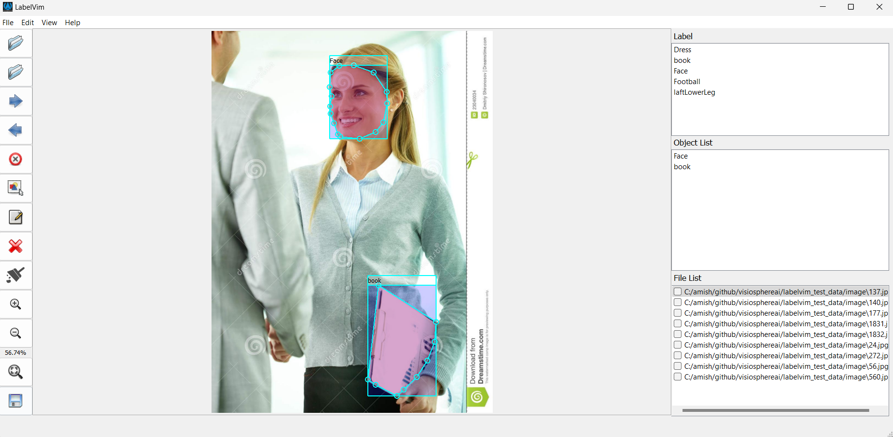
  
  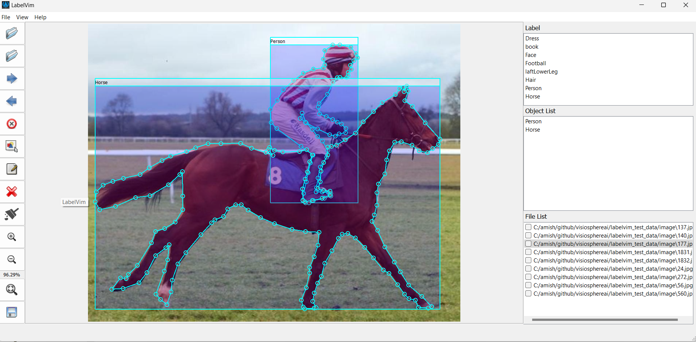
  </br>
  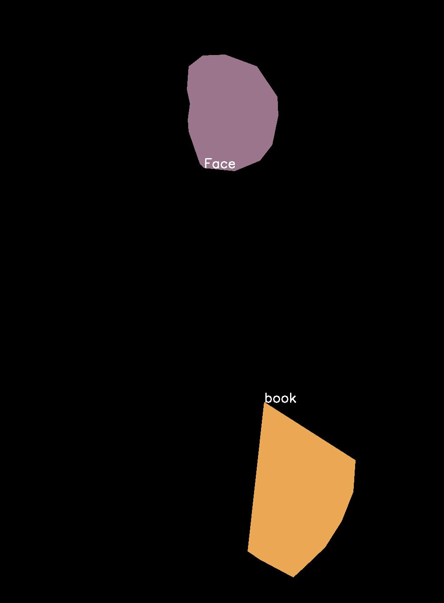
  
  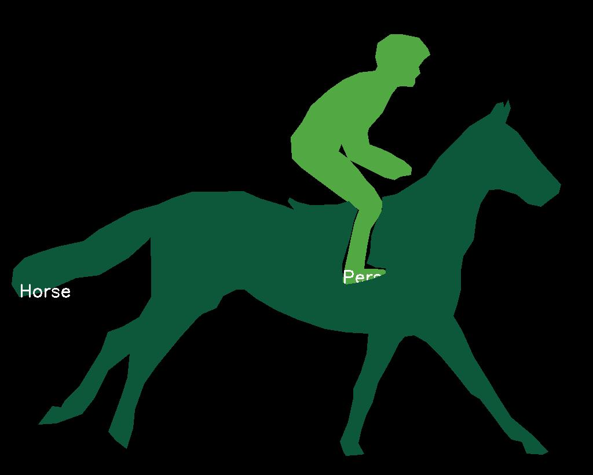
</h1> -->

<!-- ## Platform -->
<h1 align="center">
  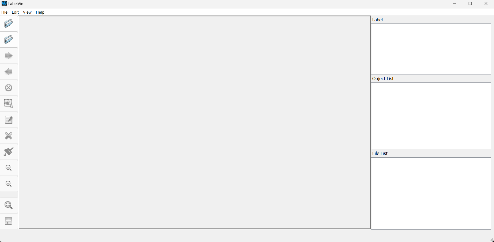
</h1>
<h1 align="center">
  Labelvim
</h1>

<h3 align="center">
 Image Annotation Tool for Segmentation and Object Detection
</h3>

This is a python based standalone image annotation tool designed for tasks such as image segmentation and object detection. The tool allows users to draw bounding boxes, polygons, and freehand paths, edit and manage annotations, and export the annotated data in multiple formats including COCO, YOLO, and PASCAL VOC.

<!-- <h1 align="center">
  
  
  
  </br>
  
  
  
</h1> -->

<h1 align="center">
  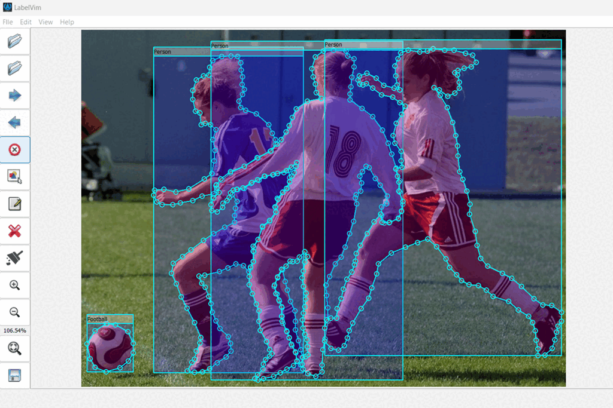
  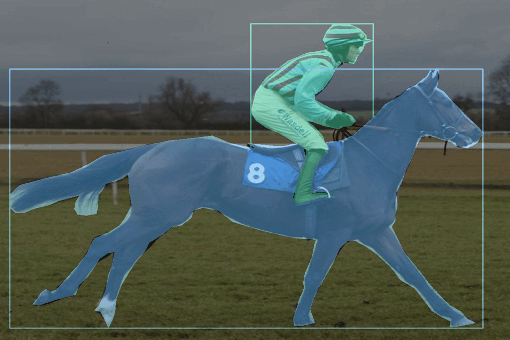
  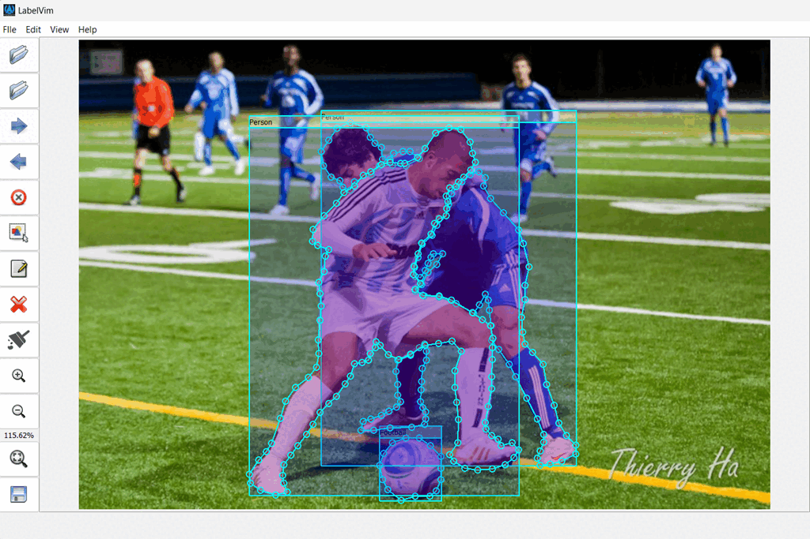
  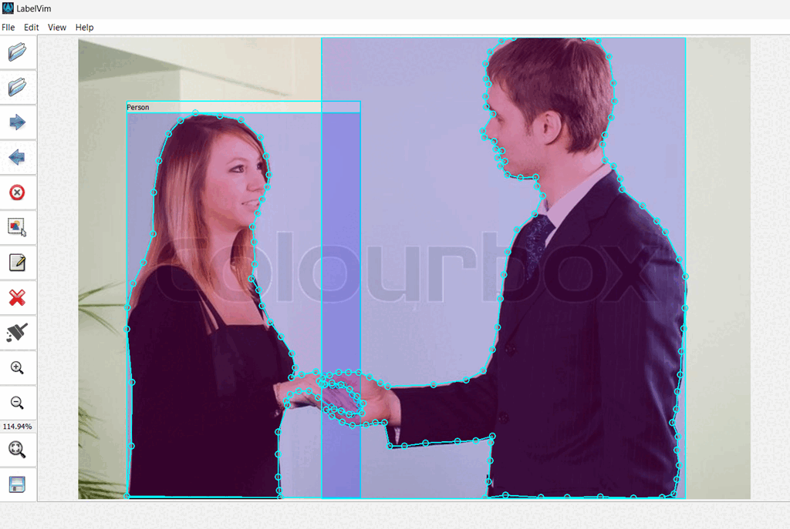
</h1>

<h1 align="center">
  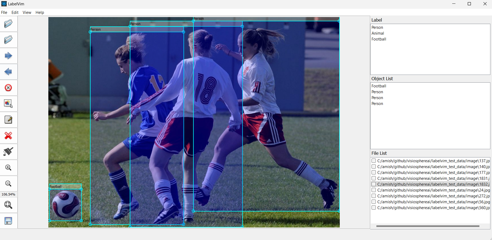
  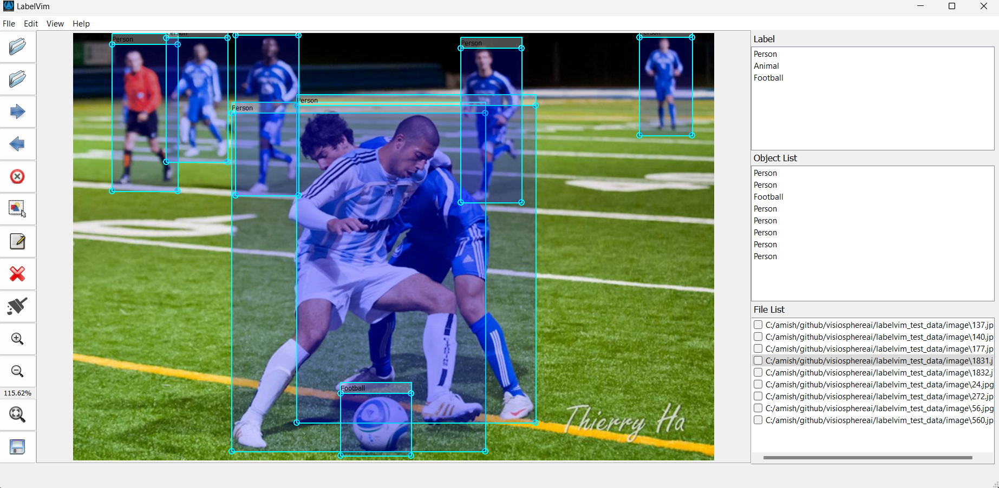
  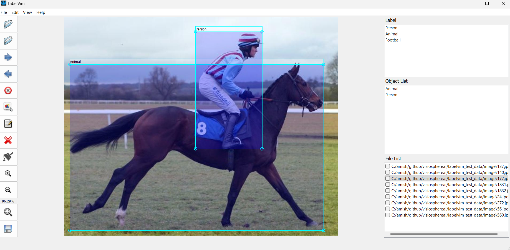
  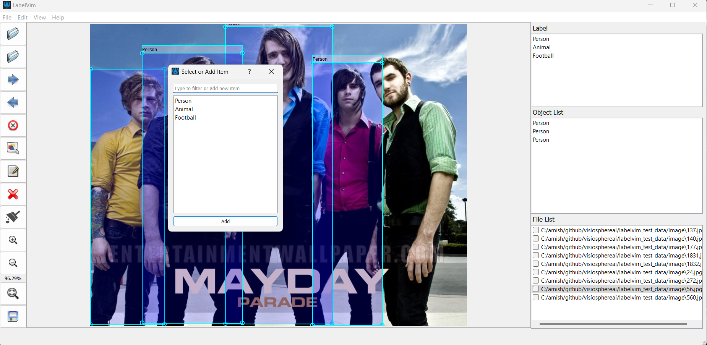
</h1>

## Features

- **Create Object**: Draw bounding boxes, polygons, or freehand paths to annotate objects in images.
- **Edit Object**: Modify existing annotations by selecting, moving, resizing, or reshaping them.
- **Delete Object**: Remove any annotation individually or clear all annotations on the image.
- **Save Annotations**: Save your work in JSON format, including object coordinates, labels, and masks.
- **Export Options**: Export annotations in multiple formats (COCO, YOLO, PASCAL VOC) with optional masks and images.
- **Download as ZIP**: Package all exported data into a ZIP file for easy download.

## Technology Stack

- **Backend**: Python, PyQt5
- **Data Export Libraries**:
  - **COCO**: Python script for converting annotations to COCO format
  - **YOLO**: Python script for converting annotations to YOLO format
  - **PASCAL VOC**: Python script for generating XML files for PASCAL VOC format

## Getting Started

### Prerequisites

- Python 3.x
- Git (for version control)

### Installation

1. **Clone the repository**:

    ```bash
    git clone https://github.com/VisioSphereAI/labelvim.git
    cd labelvim
    ```
    Install requirements
    ```bash
    pip install -r requirements.txt
    ```
    Execute GUI
    ```bash
    Python main.py
    ```


### Using the Tool

1. **Load an image** load image data using the folder selector.
2. **Create annotations** using the tools provided create object bsed on previous defined for object detection & segmentation.
3. **Edit annotations** by selecting and modifying them using mouse click.
4. **Exlude File** Using "Delete* btn or from toolbar an file can be excluded from list.
5. **Clean** Clean all annotated object.
6. **Save Mask** Save annotated mask by enabling from toolbar.
7. **Save your work** using the "Save" button. Annotations will be saved in JSON format.
8. **Export annotations** by clicking the "Export" button and choosing the desired format.
9. **Download as ZIP** to get all annotated data in a ZIP file.

### Export Formats

- **COCO**: JSON format including object classes, bounding boxes, and segmentation masks.
- **YOLO**: Text files with class labels, bounding box coordinates, and segmentation mask.
- **PASCAL VOC**: XML files with bounding box coordinates and object classes.

## Demo Video
- [Annotation](resource/videos/Annotation_object.mp4)
- [Edit Annotation](resource/videos/Edit_annotation.mp4)
- [Export](resource/videos/Object_segmentation_export.mp4)

## Contributing

Contributions are welcome! Please follow these steps:

1. Fork the repository.
2. Create a new branch (`git checkout -b feature/YourFeature`).
3. Make your changes and commit (`git commit -m 'Add some feature'`).
4. Push to the branch (`git push origin feature/YourFeature`).
5. Open a pull request.


## License

This project is licensed under the MIT License - see the [LICENSE](LICENSE) file for details.

## Acknowledgements

- Thanks to the open-source community for providing tools and libraries that make this project possible.

## Contact

If you have any questions or suggestions, feel free to open an issue or contact us directly at [pdas28oct@gmail.com](mailto:pdas28oct@gmail.com) or [amishkumar562@gmail.com](mailto:amishkumar562@gmail.com).


### Notes
This code is under development, and it has not been tested till now.
